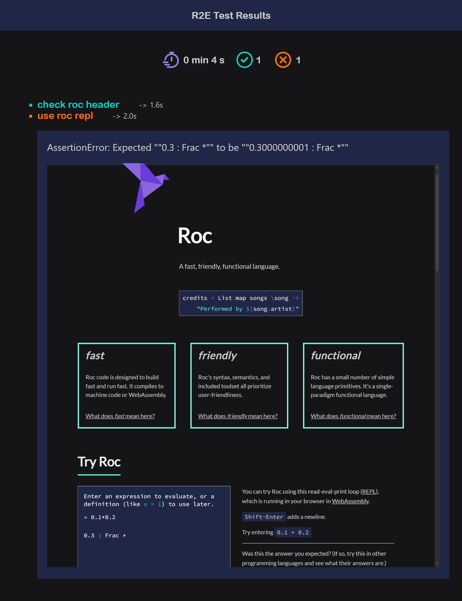

# Reporting

**Reporters** can write the test results into files in many different formats.

## Creating reporters

### createReporter

Create a custom `Reporters`.

```elixir
customReporter = Reporting.createReporter "myCustomReporter" \results, meta ->
    lenStr = results |> List.len |> Num.toStr
    indexFile = { filePath: "index.html", content: "<h3>Test count: $(lenStr)</h3>" }
    testFile = { filePath: "test.txt", content: "this is just a test" }

    [indexFile, testFile]


tests |> Test.runAllTests { reporters: [customReporter] }
```

The reporter will create 2 files `index.html` and `test.txt` in a directory
named _"myCustomReporter"_ in the default test results directory _"testResults"_:

- ./testResults/myCustomReporter/index.html
- ./testResults/myCustomReporter/test.txt

The callback function gives you 2 parameters:

```elixir
results : List TestRunResult
meta : TestRunMetadata

TestRunResult : {
    name : Str, # test name
    duration : U64, # single test duration [ms]
    # result with error message, or error message and screenshot
    result : Result {} [ErrorMsg Str, ErrorMsgWithScreenshot Str Str],
}

TestRunMetadata : {
    duration : U64, # whole test run duration [ms]
}
```

## Builtin reporters

**R2E** has couple of builtin reporters.

### BasicHtmlReporter

The `BasicHtmlReporter` create a single **html** file with the whole report.

```elixir
tests |> Test.runAllTests { reporters: [Reporting.BasicHtmlReporter.reporter] }
```

The test run will create an html file, containing basic information about the
test, and screenshots of failed tests, and should look like this:



:::warning
Right now, due to a compiler error, by default there are no reporters used.

But in future (when I'm able to compile the code) `BasicHtmlReporter` will be the default reporter.
:::
