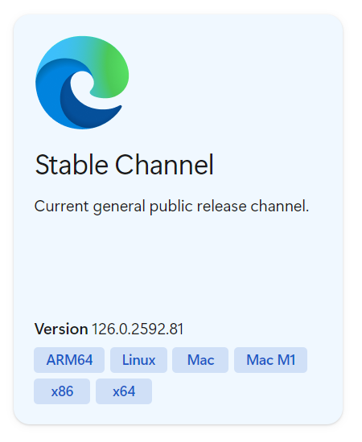

# Setup

To get started you will need:

- [Roc](https://www.roc-lang.org/) compiler
- a running webdriver

## Roc

To get instructions on how to get started with [Roc](https://www.roc-lang.org/), go to [https://www.roc-lang.org/install](https://www.roc-lang.org/install).

## Webdriver

You need any working webdriver, e.g.:

- [chromedriver](https://developer.chrome.com/docs/chromedriver/downloads) for working with the Chrome browser
- [edgedriver](https://developer.microsoft.com/en-us/microsoft-edge/tools/webdriver) for working with the Edge browser
- [geckodriver](https://github.com/mozilla/geckodriver/releases) for working with the Firefox browser

:::note

I do not recommend working with the chromedriver!

The chromedriver has to be an exact match with your browser.
E.g. if you download **ChromeDriver 114.0.5735.90** you will have to have **Chrome 114** installed on your system.

When working on MacOS - I recommend the **edgedriver**.

:::

### Installing EdgeDriver on MacOS

1. Download and install the Edge browser

   https://www.microsoft.com/en-us/edge/download

1. Download the EdgeDriver

   https://developer.microsoft.com/en-us/microsoft-edge/tools/webdriver

   Best is to use the Stable Chanel:

   

1. Unpack the zip archive

   ```bash
   unzip edgedriver_mac64.zip
   ```

1. Run the driver

   ```bash
   ./msedgedriver
   ```

   The running server should show something like this:

   ```
   Starting Microsoft Edge WebDriver 126.0.2592.81 (38151611195b9357be892bf1ae5c4b7942a1b216) on port 9515
   To submit feedback, report a bug, or suggest new features, please visit https://github.com/MicrosoftEdge/EdgeWebDriver

   Only local connections are allowed.
   Please see https://aka.ms/WebDriverSecurity for suggestions on keeping Microsoft Edge WebDriver safe.

   Microsoft Edge WebDriver was started successfully.
   ```

Now you should be able to run all the examples in this documentation!

In case of any driver or connection errors, check the logs in the running driver - this is often helpful.

## Run an example

Create a [Roc](https://www.roc-lang.org/) file with this content:

```elixir title="main.roc"
app [main] {
   pf: platform "https://github.com/roc-lang/basic-cli/releases/download/0.11.0/SY4WWMhWQ9NvQgvIthcv15AUeA7rAIJHAHgiaSHGhdY.tar.br",
   json: "https://github.com/lukewilliamboswell/roc-json/releases/download/0.10.0/KbIfTNbxShRX1A1FgXei1SpO5Jn8sgP6HP6PXbi-xyA.tar.br",
   r2e: "https://github.com/adomurad/r2e/releases/download/v0.1.9-alpha/xNfELlwnT0_LwpCyll4XcX_8yZmNcs1k5ewDcfaez_M.tar.br",
}

import pf.Task
import pf.Sleep
import r2e.Browser
import r2e.Driver

main =
   # create a driver client for http://localhost:9515
   driver = Driver.create {}
   # open roc-lang.org
   browser = Browser.open! driver "http://roc-lang.org"
   # sleep for 3s to be able to see the browser window
   Sleep.millis! 3000
   # close the browser
   browser |> Browser.close
```

When you run this example, a browser window should appear and you should see the [Roc](https://www.roc-lang.org/)
main page for **3s** and then, the browser should close.

If this is exactly what you saw, then congrats! - you should be able run all examples in this documentation without any problems.

## Troubleshooting

When you get compiler errors, then make sure you are using proper version of the basic-cli platform.

Right now, only 1 version is supported:

https://github.com/roc-lang/basic-cli/releases/tag/0.11.0

## What's next?

If you are interested in writing E2E UI tests - you should probably checkout the [E2E Framework](e2e-overview) section
to get an overview what's included in the framework.

If you are interested in using the browser outside of testing use cases - you should probably checkout
the [Browser Automation](browser-automation) section.
